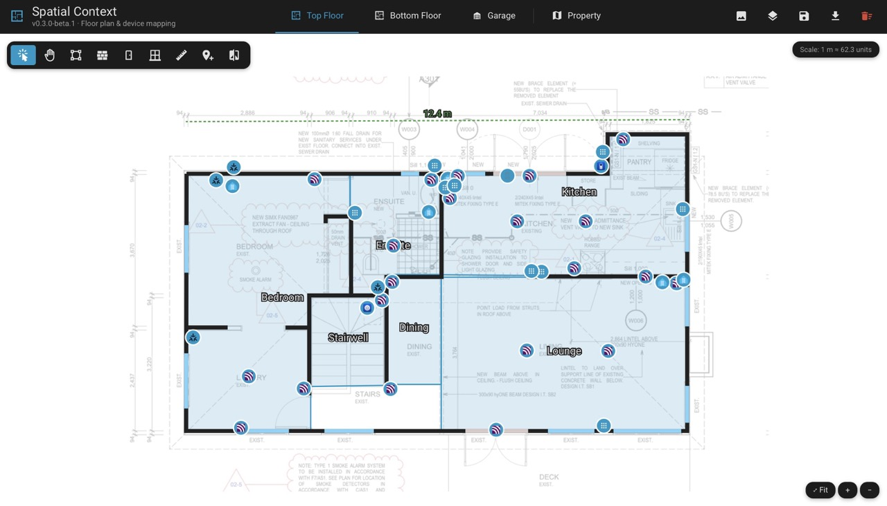
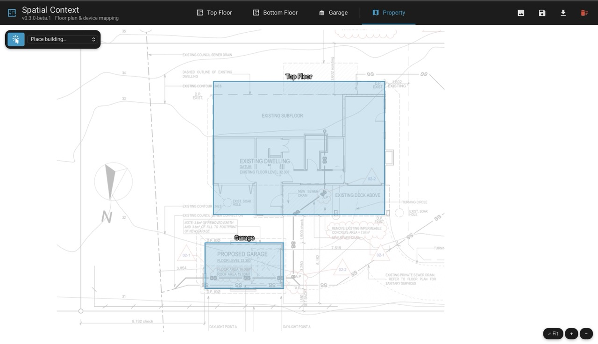
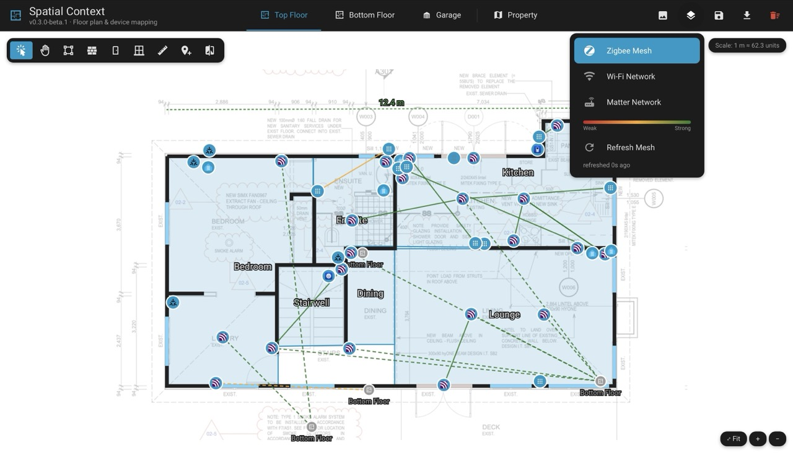
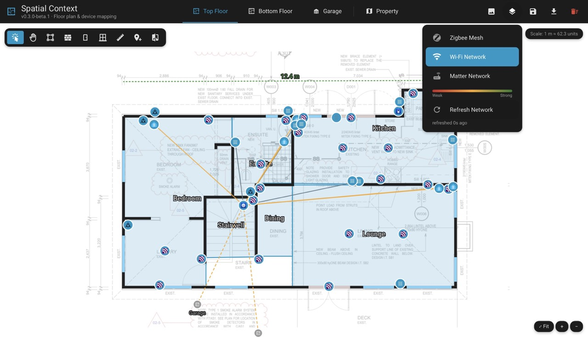
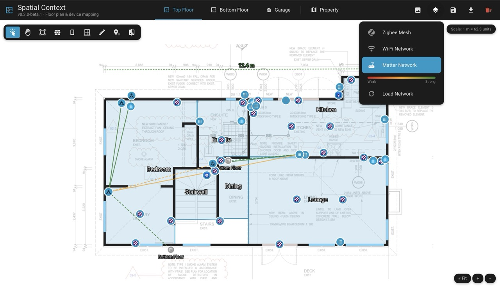

# Spatial Context


A Home Assistant custom integration for tracing your home's floor plans and placing your real devices on them — so an AI assistant (or anything else) can be given real physical/spatial grounding for your home, not just entity names.



## What it does

Adds a **Spatial Context** panel to the HA sidebar, one tab per floor — read live from HA's own floor registry (Settings → Areas → Floors), no separate floor concept to maintain. Trace each floor's rooms and walls (tagged with a material and real thickness for RF-attenuation reasoning) over a background image, calibrate it to real-world metres, then place your actual devices on it and overlay live Zigbee/Wi-Fi/Matter mesh topology directly on the map. A separate **Property** tab lets you place each building (a multi-story house aligned into one, a detached garage, etc.) on a whole-property site photo, to see how everything relates at a glance. Your chosen pan/zoom on each tab is remembered across visits once saved.

## Installation

**Beta** (see [Status](#status) below) — not yet submitted to the HACS default repository, so it needs to be added as a **custom repository** first.

### Option 1: HACS, one click

[](https://my.home-assistant.io/redirect/hacs_repository/?owner=Greminn&repository=ha-spatial-context&category=integration)

### Option 2: HACS, manually

1. In HACS: **⋮ (top-right) → Custom repositories**.
2. Paste this repository's full URL into **Repository**:
   ```
   https://github.com/Greminn/ha-spatial-context
   ```
3. Set **Type** to **Integration**, then **Add**.
4. Find **Spatial Context** in HACS and install it.

Either way, this is a beta release (tagged as a pre-release), so enable **Show beta versions** for this repository — or globally in HACS's own settings — if you don't see it.

### Option 3: manual copy, no HACS

Copy `custom_components/spatial_context/` from this repository into your Home Assistant's `/config/custom_components/` directory.

### After installing

**Settings → Devices & Services → Add Integration → Spatial Context**, and it'll appear in your sidebar.

## Getting started

1. **Set up floors in HA**, if you haven't already — **Settings → Areas → Floors**. Spatial Context has no floor concept of its own; its tabs come straight from there.
2. **Open Spatial Context** from the sidebar and pick a floor tab.
3. **Add a background image** — **Background** icon, top-right, or just drag an image file straight onto the canvas. Starting from a PDF? See [Getting a background image](#getting-a-background-image).
4. **Set the scale** — **Set Scale**, click two points a known distance apart. Do this before anything else; it's what puts every later measurement in real metres.
5. **Trace rooms and walls** — **Trace Room** / **Trace Wall**. Assign each room a real HA area, each wall a material and thickness.
6. **Place your devices** — **Place Device**, pick from the list, click the map. A device can only be placed once, on one floor.
7. **Repeat steps 3–6 for every floor.**
8. **Align floors that physically stack** (upstairs directly over downstairs) — **Align Floors**. This puts them in one coordinate system, which cross-floor Connectivity Map links need and is what lets them collapse into one building next. Leave a standalone floor (a detached garage) unaligned.
9. **Place buildings on the Property tab** — switch to **Property**, upload a site photo, then **Place Building** for each one. Aligned floors place as a single building; unaligned ones place separately.
10. **Save often** — **Save**, in the header, on whichever tab you're editing.

From here: **Connectivity Map** shows live Zigbee/Wi-Fi/Matter links over your devices, and **Export** downloads the whole layout as JSON.

## Getting a background image

Spatial Context traces over a background image per floor (via HA's built-in image upload, PNG/JPEG/GIF). If you're starting from an architect's PDF floor plan, rasterize it first, e.g.:

```
pdftoppm -png -r 150 your-floor-plan.pdf your-floor-plan
```

## Toolbar (top-left, over the canvas)

One tool is active at a time; clicking the active tool again returns to Select. Everything below is a mode you switch into, use, then switch out of — nothing here is destructive by itself (deleting something always asks first).

**Esc** cancels an in-progress trace or an armed device placement and returns to Select; **Delete**/**Backspace** deletes whatever's currently selected (same confirmation as the trash icon); **Enter** finishes an in-progress wall trace as an open run (same as the **Finish Wall** button). None of these fire while you're typing in a text field.

While tracing a room or wall, a new point snaps onto a nearby existing wall/room edge, or aligns horizontal/vertical with your last point — shown live as a preview line and marker *before* you click, so you can see it coming rather than only after. Once a shape has enough points to close, the guide also points back at its own start, so you can find exactly where a clean closing corner is. Hold **Shift** to place a point free of any snapping.

| Icon | Tool | What it does | How to use it |
|---|---|---|---|
|  | **Select** | The default mode — click anything to select it and edit it (rename, change area/material, edit vertices, delete) via the panel that appears bottom-left. | Click a room, wall, door/window, or device pin. Drag a selected shape's vertex handles to reshape it, or drag a pin to move it. Dragging empty canvas pans the view. |
|  | **Pan** | Move around the floor plan without any risk of accidentally selecting or dragging something — every drag pans, even over walls/pins. | Click the tool, then drag anywhere. Mouse wheel/trackpad scroll also pans in any mode; the **+ / −** buttons (bottom-right) zoom. |
|  | **Trace Room** | Draw a room's outline as a polygon. | Click each corner in order; click back near your starting point to close the loop. Select the finished room to assign it to a real HA area, rename it, and set its own display style — visible/hidden, fill color, fill opacity, border opacity — independently of every other room. |
|  | **Trace Wall** | Draw a wall as a line (open or closed), tagged with a material and real thickness for RF-attenuation reasoning. | Click each point along the wall; click **Finish Wall** (or press **Enter**) to end it as an open run, or click back near the start to close it into a loop. Select the finished wall to set its material (timber-framed, brick veneer, concrete/block, aerated/foam concrete block, ceramic/Poroton block, glass, steel frame) and its thickness — a dropdown next to the thickness field lets you enter it in cm or m (in/ft under Imperial, see [Settings](#header-top-right)) — attenuation is that material's per-cm rate × the wall's actual thickness, and once the floor is calibrated the drawn line width scales to match. |
|  | **Add Door** | Place a door along an existing wall. | Click on a traced wall at the point where the door sits. Select it to edit its width the same way a wall's thickness is edited (number + cm/m or in/ft picker); it renders at its own wall's real thickness, not a fixed size. |
|  | **Add Window** | Place a window along an existing wall. | Same as Add Door — click on a traced wall at the point where the window sits. |
|  | **Set Scale** | Calibrate the floor's real-world scale, so every other measurement (device spacing, exports) is in real units instead of arbitrary drawing units. | Click two points a known real-world distance apart (e.g. two ends of a wall you've measured), then enter that distance (metres, or feet under Imperial) when prompted. Re-run any time to recalibrate. |
|  | **Place Device** | Drop a pin for one of your real, live HA devices. | Opens the device picker on the right — search or filter by floor/area, click a device to arm it, then click on the map to place its pin (click an existing pin to stack a co-located device on top of it instead). A device already placed on a *different* floor is greyed out and can't be placed again here. |
|  | **Align Floors** | Line up two floors that physically stack (e.g. an upstairs and downstairs) into one shared coordinate system. | Pick another floor from the dropdown that appears — its background image overlays yours, semi-transparent. Drag to reposition it and use the **+ / −** buttons to rescale, then **Apply** to rigidly transform every room/wall/pin/door/window on that floor to match (and copy this floor's scale calibration onto it). **Cancel** discards the adjustment. Floors that aren't physically stacked (a detached garage, say) should just stay unaligned. |

## Header (top-right)

| Icon | Name | What it does |
|---|---|---|
|  | **Background** | Upload, replace, or remove the current floor's background image, and adjust its opacity. You can also just drag an image file straight onto the canvas instead of using this menu. |
|  | **Connectivity Map** | Toggle a live mesh overlay — Zigbee, Wi-Fi, or Matter/Thread — drawn between your placed devices, quality-graded (LQI/RSSI where available). Off by default; picking a layer and hitting Load/Refresh/Connect fetches it. Click any line for details on what it connects and its link quality. A link to a device on a *different* floor draws as a dashed line toward that floor (its real direction, using your Property tab placements) instead of just disappearing — click its marker to jump straight there. Closing this menu turns the overlay back off. |
|  | **Save** | Save the current floor's (or Property tab's) layout, including whatever pan/zoom you're currently looking at — that view is restored next time you open this floor/tab. A dot badge shows when there are unsaved changes. |
|  | **Settings** | App-wide preferences, shared by everyone who opens the panel (not per-browser). Currently just one: **Metric (m / cm)** or **Imperial (ft / in)** — governs the default unit shown in every real-world measurement (scale calibration, wall thickness, opening width, device height). Applies instantly, no Save needed. |
|  | **More options** | **Export** — download a denormalized JSON snapshot (floors → rooms → devices, in real units once calibrated) for use outside Home Assistant. **Reset floor / Reset property** — clear the current floor's rooms/walls/devices/background (or, on the Property tab, every building placement and the site photo) entirely, to start over. Asks for confirmation first, and only takes effect once you also hit Save. |

## Floor tabs & the Property tab

The tab bar shows one tab per HA floor (with that floor's own icon, or a generic floor icon if it hasn't been given one), plus a fixed **Property** tab () at the end.

The Property tab is a separate, whole-property view — upload a site/aerial photo (same **Background** menu as a floor), then place a labeled, rotatable rectangle for each *building*: two floors linked via **Align Floors** collapse to a single placement (so a multi-story house shows as one shape), while a floor that's never been aligned to anything (a detached garage, say) gets its own.

- **Place Building**: pick a building from the dropdown in the top-left toolbar, then click the site photo to drop it there.
- Select a placement to **drag it into position**, **drag a corner to resize it** (the opposite corner stays fixed, and the shape is locked to that building's real proportions — computed from its traced rooms/walls, so it can't be squashed into an unrealistic shape), or **drag the handle above it to rotate** it to match the photo's orientation.
- The selection panel also offers **Rename** (a label override), **Delete**, and **Go to floor** — jumps straight to that building's own floor tab.

## Screenshots

| Property tab | Zigbee mesh |
|---|---|
|  |  |

| Wi-Fi mesh | Matter mesh |
|---|---|
|  |  |

## Development (frontend)

The panel is built from `frontend/` (Lit + TypeScript) into a single bundle at `custom_components/spatial_context/www/spatial-context-panel.js`, which is committed — HACS and a manual copy both install this repo as-is with no build step, so that file has to already be there and up to date with the source.

To change the frontend:

```
cd frontend
npm install
npm run build
```

Then get that one built file onto your HA instance, however you can reach its config directory — copy it over Samba, use the File editor/Studio Code Server add-on, `scp`/`rsync` if you have SSH, or whatever else applies to your setup. A hard browser refresh picks it up immediately (no HA restart needed, since it's served from its own static path, not a versioned Lovelace resource).

If you *do* have SSH access to your HA host, `frontend/scripts/dev/push.mjs` (via `npm run push` / `npm run dev`) automates that last step — rsyncs the bundle over on every build, optionally watching for changes. It's purely a convenience for that one setup, not a requirement; copy `frontend/.env.example` to `frontend/.env` and fill in `HA_HOST`/`HA_DEV_PATH` to use it.

## Status

**Beta — work in progress.** Actively developed, used daily on the author's own multi-floor home — but the interface and storage format may still change between releases, and it hasn't yet been tested against the wide variety of Home Assistant setups a stable release should handle.

Found a bug, or have an idea for something it should do? Please [open an issue](https://github.com/Greminn/ha-spatial-context/issues) — both problems and feature ideas are genuinely welcome, not just polished bug reports.

## License

[MIT](LICENSE)
