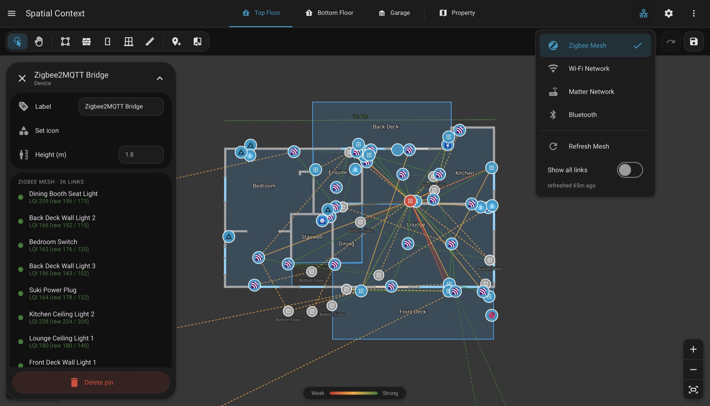
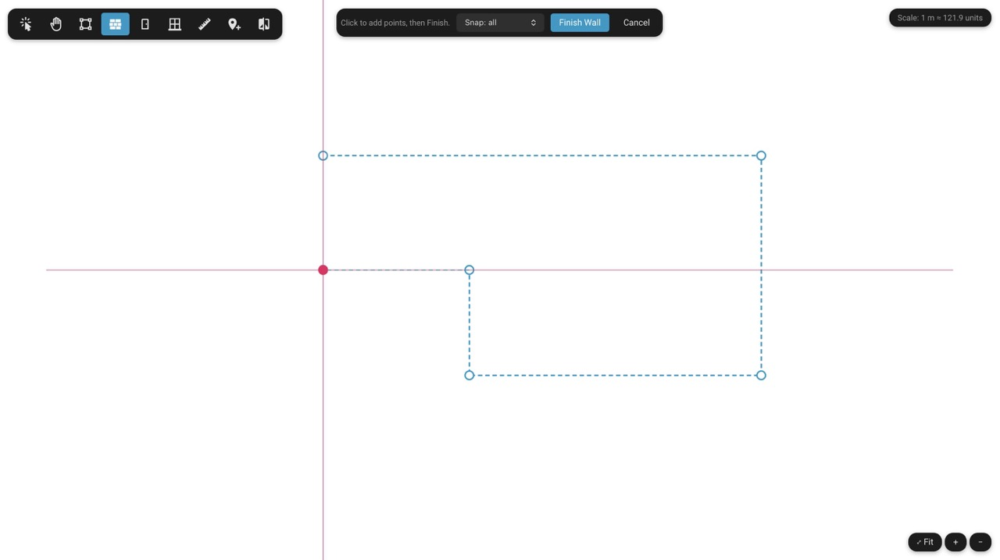
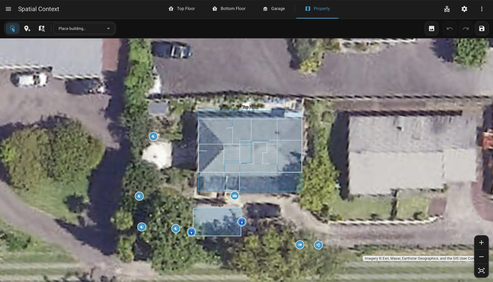
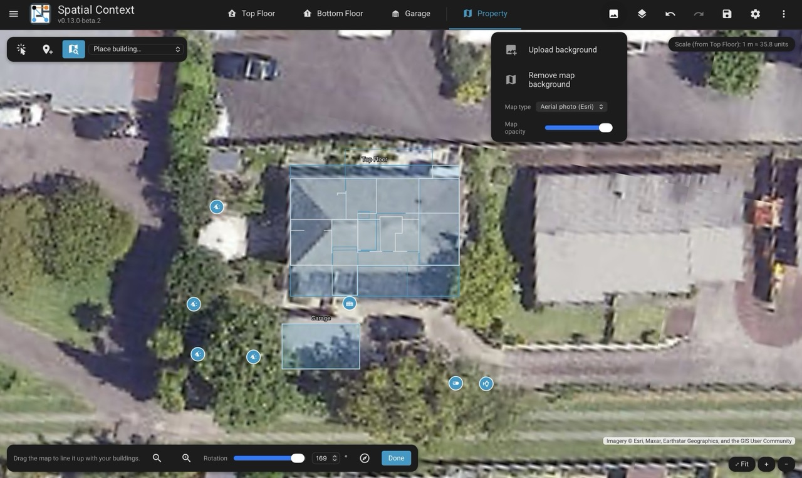
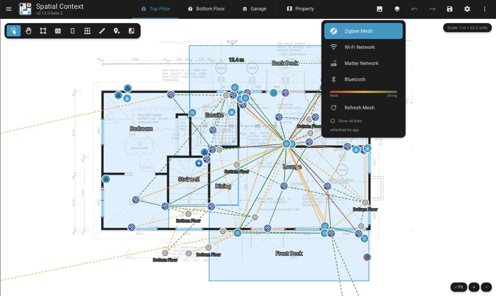
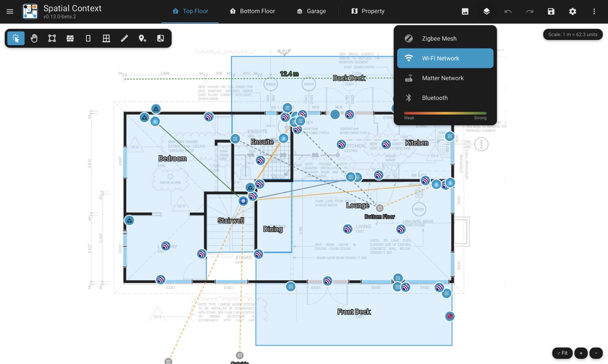
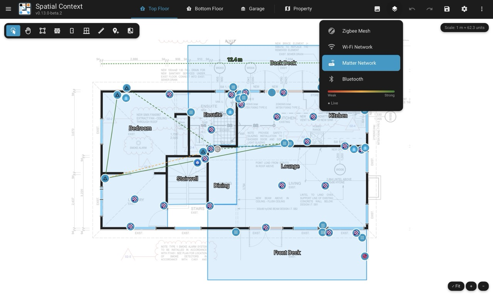
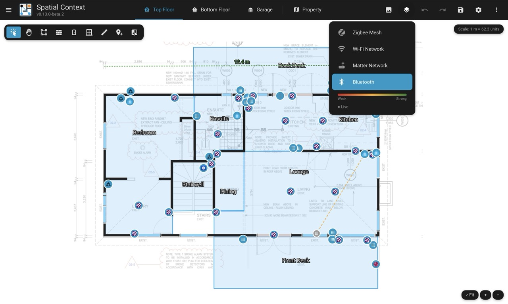
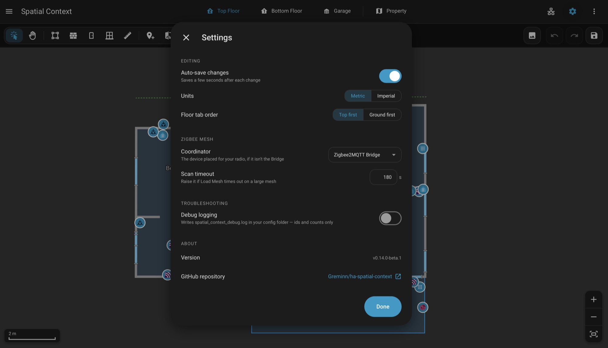
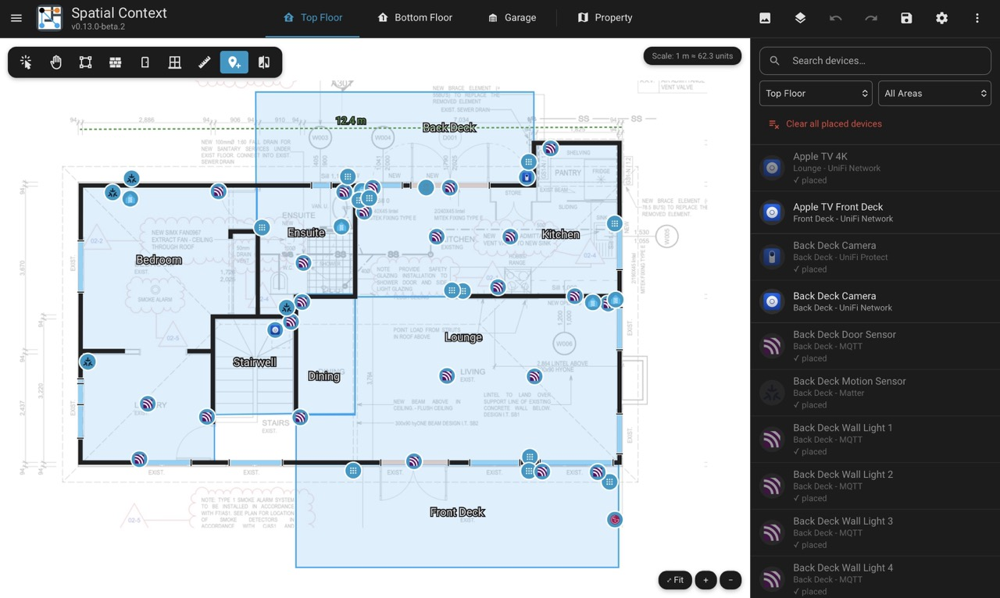

# Spatial Context


A Home Assistant custom integration for tracing your home's floor plans and placing your real devices on them — so an AI assistant (or anything else) can be given real physical/spatial grounding for your home, not just entity names.



## What it does

Adds a **Spatial Context** panel to the HA sidebar, one tab per floor — read live from HA's own floor registry (Settings → Areas → Floors), no separate floor concept to maintain. Trace each floor's rooms and walls (tagged with a material and real thickness for RF-attenuation reasoning) over a background image, calibrate it to real-world metres, then place your actual devices on it and overlay live Zigbee/Wi-Fi/Matter/Bluetooth mesh topology directly on the map. A separate **Property** tab lets you place each building (a multi-story house aligned into one, a detached garage, etc.) on a whole-property site photo or a live street/aerial map, along with devices that live outdoors (garden lights, a gate sensor), to see how everything relates at a glance. Edits save automatically and can be undone, and your chosen pan/zoom on each tab is remembered across visits.

## Requirements

- **Home Assistant 2024.10** or newer, with your floors set up in **Settings → Areas → Floors**.
- The **Connectivity Map** layers each need their own source — install whichever apply:

| Layer | Needs |
|---|---|
| Zigbee | **Zigbee2MQTT**, connected to Home Assistant over MQTT (ZHA isn't supported) |
| Wi-Fi | An integration that reports each client's access point: **UniFi Network**, **TP-Link Omada**, or the custom **TP-Link Deco** integration |
| Matter | Home Assistant's **Matter** integration |
| Bluetooth | **Home Assistant 2025.2** or newer, an **admin** account, and Bluetooth devices registered by an integration (BTHome, Xiaomi BLE, SwitchBot and similar); ESPHome Bluetooth proxies are supported |

The Property tab's optional **map background** needs **Home Assistant 2026.10** or newer (its built-in map tile service) and a home location set in HA; a browser with WebGL2 draws it. Everything else works without it.

## Installation

**Beta** (see [Status](#status) below) — not yet submitted to the HACS default repository, so it needs to be added as a **custom repository** first.

### Option 1: HACS, one click

[](https://my.home-assistant.io/redirect/hacs_repository/?owner=Greminn&repository=ha-spatial-context&category=integration)

### Option 2: HACS, manually

1. In HACS: **⋮ (top-right) → Custom repositories**.
2. Paste this repository's full URL into **Repository**:
   ```
   https://github.com/Greminn/ha-spatial-context
   ```
3. Set **Type** to **Integration**, then **Add**.
4. Find **Spatial Context** in HACS and install it.

Either way, this is a beta release (tagged as a pre-release), so enable **Show beta versions** for this repository — or globally in HACS's own settings — if you don't see it.

### Option 3: manual copy, no HACS

Copy `custom_components/spatial_context/` from this repository into your Home Assistant's `/config/custom_components/` directory.

### After installing

**Settings → Devices & Services → Add Integration → Spatial Context**, and it'll appear in your sidebar.

## Getting started

1. **Set up floors in HA**, if you haven't already — **Settings → Areas → Floors**. Spatial Context has no floor concept of its own; its tabs come straight from there.
2. **Open Spatial Context** from the sidebar and pick a floor tab.
3. **Add a background image** — **Background** icon, top-right, or just drag an image file straight onto the canvas. Starting from a PDF? See [Getting a background image](#getting-a-background-image).
4. **Set the scale** — **Set Scale**, click two points a known distance apart. Do this before anything else; it's what puts every later measurement in real metres.
5. **Trace rooms and walls** — **Trace Room** / **Trace Wall**. Assign each room a real HA area, each wall a material and thickness.
6. **Place your devices** — **Place Device**, pick from the list, click the map. A device can only be in one place: one floor, or outdoors on the Property tab.
7. **Repeat steps 3–6 for every floor.**
8. **Align floors that physically stack** (upstairs directly over downstairs) — **Align Floors**. This puts them in one coordinate system, which cross-floor Connectivity Map links need and is what lets them collapse into one building next. Leave a standalone floor (a detached garage) unaligned.
9. **Place buildings on the Property tab** — switch to **Property**, then either upload a site photo or add a live map (see [the Property tab](#floor-tabs--the-property-tab)), and use **Place Building** for each one. Aligned floors place as a single building; unaligned ones place separately.
10. **Place outdoor devices** — on the Property tab, use **Place outdoor device** for anything outside every building (garden lights, a gate sensor). Decks and other outdoor areas attached to the house can instead be drawn as rooms on a floor.
11. **Saving** — changes save automatically a few seconds after each edit (turn off under Settings → **Auto-save changes** to save manually with **Save** in the header).

From here: **Connectivity Map** shows live Zigbee/Wi-Fi/Matter/Bluetooth links over your devices, and **Export** downloads the whole layout as JSON.

## Getting a background image

Spatial Context traces over a background image per floor (via HA's built-in image upload, PNG/JPEG/GIF). If you're starting from an architect's PDF floor plan, rasterize it first, e.g.:

```
pdftoppm -png -r 150 your-floor-plan.pdf your-floor-plan
```

## Toolbar (top-left, over the canvas)

One tool is active at a time; clicking the active tool again returns to Select. Everything below is a mode you switch into, use, then switch out of — nothing here is destructive by itself (deleting something always asks first).

**Esc** cancels an in-progress trace or an armed device placement and returns to Select — or, in the middle of a drag (a room, device, label, corner or building), puts it straight back where it was. **Ctrl/Cmd+Z** undoes your last edit and **Ctrl/Cmd+Shift+Z** (or **Ctrl+Y**) redoes it — the same as the undo/redo buttons in the header. History is kept for the open floor and for the Property tab, and a drag or slider counts as one step. While you're tracing a room, wall or scale line, **Ctrl/Cmd+Z** or **Backspace** removes just the last point instead. **Delete**/**Backspace** deletes whatever's currently selected (same confirmation as the trash icon); **Enter** finishes an in-progress wall trace as an open run (same as the **Finish Wall** button). None of these fire while you're typing in a text field.

While tracing a room or wall, a new point snaps onto a nearby existing wall/room edge, or aligns horizontal/vertical with your last point — shown live as a preview line and marker *before* you click, so you can see it coming rather than only after. Once a shape has enough points to close, the guide also points back at its own start, so you can find exactly where a clean closing corner is. The **Snap** menu in the drawing bar picks what new points snap onto: **all** (walls and rooms), **walls only** / **rooms only** (just the kind you're drawing, so a wall traced along a room's edge doesn't jump onto it), or **off**. It's remembered per browser and also applies to dragging corners. Hold **Shift** to place a single point free of any snapping.



| Icon | Tool | What it does | How to use it |
|---|---|---|---|
|  | **Select** | The default mode — click anything to select it and edit it (rename, change area/material, edit vertices, delete) via the panel that appears bottom-left. | Click a room, wall, door/window, or device pin. Drag a selected shape's vertex handles to reshape it, or drag a pin to move it. Drag inside a selected room to move the whole room, along with the devices placed in it (walls stay put) — a dashed outline marks where it started, and bringing it back close snaps it exactly home. While dragging, its corners also snap into line with other rooms' and walls' corners (pink guides show the alignment; hold **Shift** to drag freely). Drag a selected room's name to move its label somewhere more readable (**Reset label position** in its panel puts it back) — by default a label sits at the most open spot inside the room. Dragging empty canvas pans the view. |
|  | **Pan** | Move around the floor plan without any risk of accidentally selecting or dragging something — every drag pans, even over walls/pins. | Click the tool, then drag anywhere. Mouse wheel/trackpad scroll also pans in any mode; the **+ / −** buttons (bottom-right) zoom. |
|  | **Trace Room** | Draw a room's outline as a polygon. | Click each corner in order; click back near your starting point to close the loop. Select the finished room to assign it to a real HA area, rename it, and set its own display style — visible/hidden, fill color, fill opacity, border opacity — independently of every other room. |
|  | **Trace Wall** | Draw a wall as a line (open or closed), tagged with a material and real thickness for RF-attenuation reasoning. | Click each point along the wall; click **Finish Wall** (or press **Enter**) to end it as an open run, or click back near the start to close it into a loop. Select the finished wall to set its material (timber-framed, brick veneer, concrete/block, aerated/foam concrete block, ceramic/Poroton block, glass, steel frame) and its thickness — a dropdown next to the thickness field lets you enter it in cm or m (in/ft under Imperial, see [Settings](#header-top-right)) — attenuation is that material's per-cm rate × the wall's actual thickness, and once the floor is calibrated the drawn line width scales to match. |
|  | **Add Door** | Place a door along an existing wall. | Click on a traced wall at the point where the door sits. Select it to edit its width the same way a wall's thickness is edited (number + cm/m or in/ft picker); it renders at its own wall's real thickness, not a fixed size. |
|  | **Add Window** | Place a window along an existing wall. | Same as Add Door — click on a traced wall at the point where the window sits. |
|  | **Set Scale** | Calibrate the floor's real-world scale, so every other measurement (device spacing, exports) is in real units instead of arbitrary drawing units. | Click two points a known real-world distance apart (e.g. two ends of a wall you've measured), then enter that distance (metres, or feet under Imperial) when prompted. Re-run any time to recalibrate. |
|  | **Place Device** | Drop a pin for one of your real, live HA devices. | Opens the device picker on the right — search or filter by floor/area, click a device to arm it, then click on the map to place its pin (click an existing pin to stack a co-located device on top of it instead). A device already placed on a *different* floor is greyed out and can't be placed again here. Drag the picker's left edge to resize it (handy for long device names) — your chosen width is remembered on this browser. Select a placed device and use **Set icon** to pick a different icon: search all Material Design Icons by name or keyword (e.g. *lamp*, *gate*, *motion*), with suggestions from the device's name — or **Use default icon** to go back. Icons come from Home Assistant itself, nothing is fetched from outside it. |
|  | **Align Floors** | Line up two floors that physically stack (e.g. an upstairs and downstairs) into one shared coordinate system. | Pick another floor from the dropdown that appears — its background image overlays yours, semi-transparent. Drag to reposition it and use the **+ / −** buttons to rescale, then **Apply** to rigidly transform every room/wall/pin/door/window on that floor to match (and copy this floor's scale calibration onto it). **Cancel** discards the adjustment. Floors that aren't physically stacked (a detached garage, say) should just stay unaligned. |

## Header (top-right)

| Icon | Name | What it does |
|---|---|---|
|  | **Background** | Upload, replace, or remove the current floor's background image, and adjust its opacity. You can also just drag an image file straight onto the canvas instead of using this menu. On the Property tab it also holds the **map background** controls (see [below](#floor-tabs--the-property-tab)). |
|  | **Connectivity Map** | Show a live network overlay — **Zigbee**, **Wi-Fi**, **Matter/Thread** or **Bluetooth** — drawn between your placed devices and coloured by link quality. Off by default; the layer you pick stays on after you close the menu, until you pick it again. See [Connectivity Map](#connectivity-map) below for what each layer shows. |
|   | **Undo / Redo** | Step back through your edits on the current floor or the Property tab (also **Ctrl/Cmd+Z** and **Ctrl/Cmd+Shift+Z**). A drag counts as one step, and even **Reset floor** can be undone. History starts fresh when you switch floors. |
|  | **Save** | Save the current floor's (or Property tab's) layout, including whatever pan/zoom you're currently looking at — that view is restored next time you open this floor/tab. A dot badge shows when there are unsaved changes. With **Auto-save changes** on (Settings, on by default) edits save themselves a few seconds after each change, and switching floors saves first instead of asking — except after **Reset floor/property** or **remove all devices**, which wait for you to press Save. Refreshing or closing the tab with unsaved changes asks first. |
|  | **Settings** | App-wide preferences, shared by everyone who opens the panel and applied instantly. **Editing:** **Auto-save changes** (on by default), **Units** — Metric or Imperial, for every real-world measurement (scale, wall thickness, opening width, device height) — and **Floor tab order** (top floor first, like HA's Areas page, or ground floor first; display only, your floors' levels aren't touched). **Zigbee mesh:** the **Coordinator** device — by default the coordinator's links attach to the Zigbee2MQTT Bridge device; if your radio is its own HA device (e.g. an SLZB-06 network adapter) and that's what you've placed, pick it here — and the **Scan timeout** (30–600 s, default 180; raise it if Load Mesh times out on a large mesh). **Troubleshooting:** **Debug logging** — see [Reporting a problem](#reporting-a-problem). |
|  | **More options** | **Export JSON** — download a denormalized snapshot (floors → rooms → devices, plus outdoor devices, in real units once calibrated) for use outside Home Assistant. **Download debug report** — see [Reporting a problem](#reporting-a-problem). **Reset floor / Reset property** — clear the current floor's rooms, walls, devices and background (or, on the Property tab, every building placement, outdoor device and the site photo) to start over. Asks first, can be undone, and isn't saved until you press **Save** — even with auto-save on. |

## Connectivity Map

Pick a layer from the **Connectivity Map** menu (header, top-right) to draw that network's links between your placed devices, coloured weak → strong. Click any line for what it connects and its signal figures.

- **Zigbee** — from Zigbee2MQTT's network scan. Scans take a minute or two, so results are cached: picking the layer shows the last scan, and **Load / Refresh Mesh** runs a new one. Call the `spatial_context.refresh_zigbee_mesh` action from an automation (overnight, say) to keep that cache warm. By default it draws each device's strongest link on its own floor and to other floors, every parent/child route, and the coordinator's direct links (LQI 50+); tick **Show all links** for the full neighbour table, like Z2M's own map. LQI isn't comparable between chipsets (some Hue bulbs report near 255 for everything; TI coordinators read low), so each device's readings are corrected for its own scale — worked out from how it and its neighbours rate the same links — and a link is graded on its weaker side. The link details show both the corrected and raw values.
- **Wi-Fi** — each client linked to its access point, with signal strength where available. Works with UniFi Network (including clients whose tracker entity is disabled), TP-Link Omada and the custom TP-Link Deco integration.
- **Matter / Thread** — Home Assistant's own Matter network topology, updating live.
- **Bluetooth** — each Bluetooth LE device Home Assistant has registered, linked to the scanner or ESPHome proxy that hears it best, graded by RSSI. Updates live from Home Assistant's own Bluetooth data (the same as **Settings → Bluetooth → Visualization**). Place each proxy's ESPHome device and your BLE devices for the lines to appear.

**Across floors and outdoors:** a link to a device on another floor draws as a dashed line toward that device's real position, with a marker you can click to jump to that floor (separate buildings use their Property tab placements for direction). Links to devices placed outdoors work the same way, labelled **Outside**, and the Property tab shows every link with an outdoor end.

## Using it with AI assistants and automations

- **`spatial_context.get_map`** returns the whole layout — floors, rooms, walls with their materials and signal loss, and every placed device (indoor and outdoor) with its position in real units — as the action's response. It's the same data as **Export JSON**, so an AI assistant or script can reason about where things physically are.
- **`spatial_context.refresh_zigbee_mesh`** runs a fresh Zigbee scan (a minute or two) and caches the result, so the panel's Zigbee layer opens instantly — handy as a nightly automation.

## Reporting a problem

1. Turn on **Settings → Debug logging**, then reproduce the problem. The panel records what it does (loads, saves, errors, map loads) to `spatial_context_debug.log` in your Home Assistant config folder, capped at about 1 MB.
2. Use **More options → Download debug report** and attach the file to a [GitHub issue](https://github.com/Greminn/ha-spatial-context/issues). It contains versions, settings, per-floor counts and the recent log — ids and counts only, never device names or positions.
3. Turn Debug logging off again afterwards.

## After updating

The panel checks itself against what's installed each time it opens (and whenever you come back to its tab). If Home Assistant hasn't been restarted since Spatial Context was updated, a banner asks you to restart — until then some changes can't be saved. If your browser is still running an older copy of the panel, a banner asks you to reload the page.

## Floor tabs & the Property tab

The tab bar shows one tab per HA floor (with that floor's own icon, or a generic floor icon if it hasn't been given one), plus a fixed **Property** tab () at the end.

The Property tab is a separate, whole-property view — give it a backdrop (an uploaded site/aerial photo, a live map, or both), then place a labeled, rotatable rectangle for each *building*: two floors linked via **Align Floors** collapse to a single placement (so a multi-story house shows as one shape), while a floor that's never been aligned to anything (a detached garage, say) gets its own.

- **Map background** (needs HA 2026.10+): **Background → Add map background** puts a live map behind everything, centred on your Home Assistant home location. **Map type** switches between **Street map** — drawn from Home Assistant's own map tile service, so there's no key and no third-party request — and **Aerial photo (Esri)**, which makes it far easier to place a house on its roof. Aerial tiles are loaded by your browser straight from Esri's servers (Esri sees your IP address and the area you're viewing), and its credit is shown on the canvas; OpenStreetMap's is shown for the street map. A **Map opacity** slider sits beside it, and an uploaded background image still draws on top of the map, so you can use both.
- **Move map** (the map-search button in the toolbar, shown while a map is on): your buildings stay where they are and the map moves under them, so you can line a footprint up with the real roof. **Drag** to move it, **Ctrl+scroll** or the zoom buttons to zoom, **Shift+scroll** or the slider to rotate (the compass button turns it back to north-up), or **pinch and twist** on a touch screen. Switching between street and aerial keeps the same position. The map is saved with the layout and its moves can be undone.
- **Ghost outline**: each placed building shows its traced rooms and walls inside its rectangle, so you can see exactly how well it fits the photo or map as you move, rotate and resize it.
- **Place Building**: pick a building from the dropdown in the top-left toolbar, then click the site photo to drop it there.
- **Scale**: no separate calibration step. Once a placed building has a floor with **Set Scale** done, the Property tab works out its own scale from that building's size on the photo (shown top-right), and outdoor devices get real-world positions in the export. With several calibrated buildings the largest is used, and the badge warns if they disagree, which usually means one is sized wrong against the photo.
- **Place outdoor devices** (): for devices outside every building — garden lights, a driveway sensor. The device picker opens on **Outdoor / no floor** (HA areas with no floor). A device lives in one place only, so placing it outdoors takes it off any floor, and vice versa.
- **Connectivity Map outdoors**: the same Zigbee/Wi-Fi/Matter/Bluetooth overlay works here, for every link with an outdoor end. A link to an indoor device is drawn dashed to that device's real spot inside its building (worked out from the building's placement), with a button to jump to its floor. On a floor, a link to an outdoor device draws as a stub toward its real position, labelled **Outside**.
- **Outdoor areas on a floor plan**: an area HA has on no floor (a Back Deck, say) can still be drawn onto a floor — pick it under **Outdoor / no floor** in a room's area list. Its devices then appear under that floor in the device picker. The area itself isn't moved onto the floor in HA.
- Select a placement to **drag it into position**, **drag a corner to resize it** (the opposite corner stays fixed, and the shape is locked to that building's real proportions — computed from its traced rooms/walls, so it can't be squashed into an unrealistic shape), or **drag the handle above it to rotate** it to match the photo's orientation.
- The selection panel also offers **Rename** (a label override), **Delete**, and **Go to floor** — jumps straight to that building's own floor tab.

## Screenshots

| Property tab — aerial map, buildings and outdoor devices | Move map — line the map up with a building |
|---|---|
|  |  |

| Zigbee mesh | Wi-Fi network |
|---|---|
|  |  |

| Matter network | Bluetooth |
|---|---|
|  |  |

| Settings | Placing devices |
|---|---|
|  |  |

## Development (frontend)

The panel is built from `frontend/` (Lit + TypeScript) into `custom_components/spatial_context/www/`, and the output is committed — HACS and a manual copy both install this repo as-is with no build step, so the built files have to already be there and up to date with the source. A build writes three files that always go together:

- `spatial-context-panel.js` — the panel itself.
- `spatial-context-panel.build.json` — its build id, which the panel's update check compares against.
- `mdi-index.json` — the icon picker's search index.

To change the frontend:

```
cd frontend
npm install
npm run build
```

Then copy all three files onto your HA instance's `custom_components/spatial_context/www/`, however you can reach its config directory — Samba, the File editor/Studio Code Server add-on, `scp`/`rsync` over SSH, or whatever applies to your setup. A browser reload picks up the new panel (it's served with `Cache-Control: no-cache`). Changes to the Python side (`custom_components/spatial_context/*.py`) need a Home Assistant restart.

If you *do* have SSH access to your HA host, `frontend/scripts/dev/push.mjs` (via `npm run push` / `npm run dev`) automates that last step — rsyncs all three build files over on every build, optionally watching for changes. It's purely a convenience for that one setup, not a requirement; copy `frontend/.env.example` to `frontend/.env` and fill in `HA_HOST`/`HA_DEV_PATH` to use it.

## Status

**Beta — work in progress.** Actively developed, used daily on the author's own multi-floor home — but the interface and storage format may still change between releases, and it hasn't yet been tested against the wide variety of Home Assistant setups a stable release should handle.

Found a bug, or have an idea for something it should do? Please [open an issue](https://github.com/Greminn/ha-spatial-context/issues) — both problems and feature ideas are genuinely welcome, not just polished bug reports.

## License

[MIT](LICENSE)
