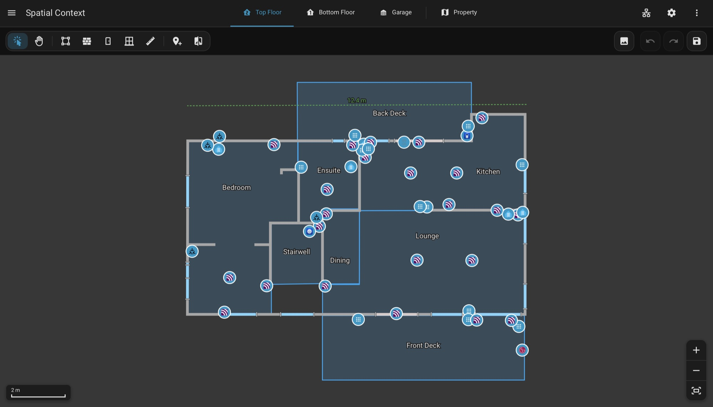
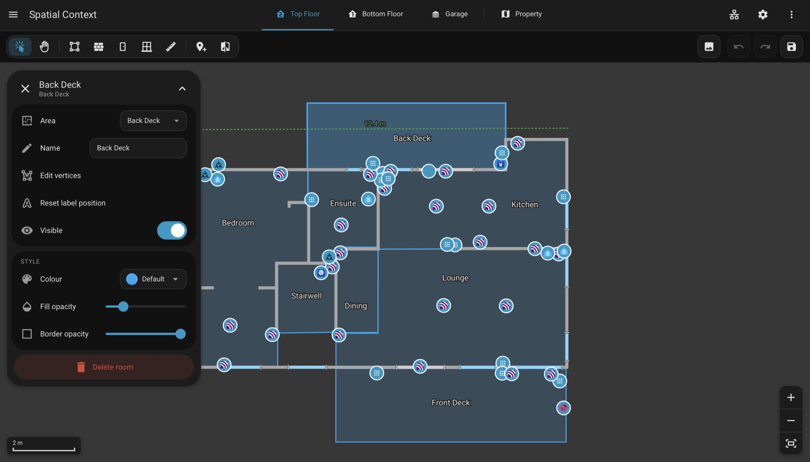
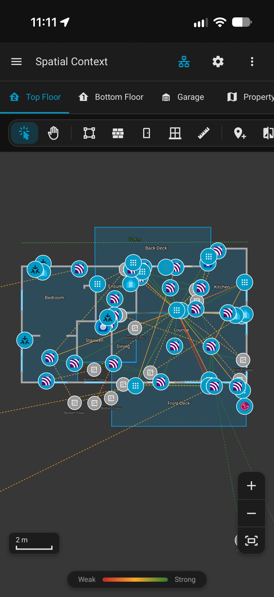
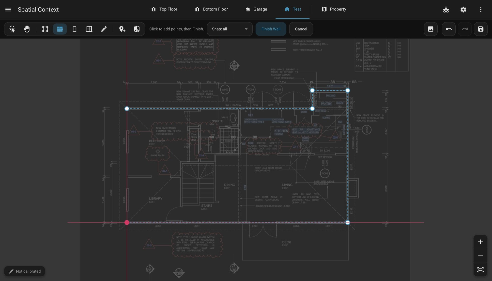
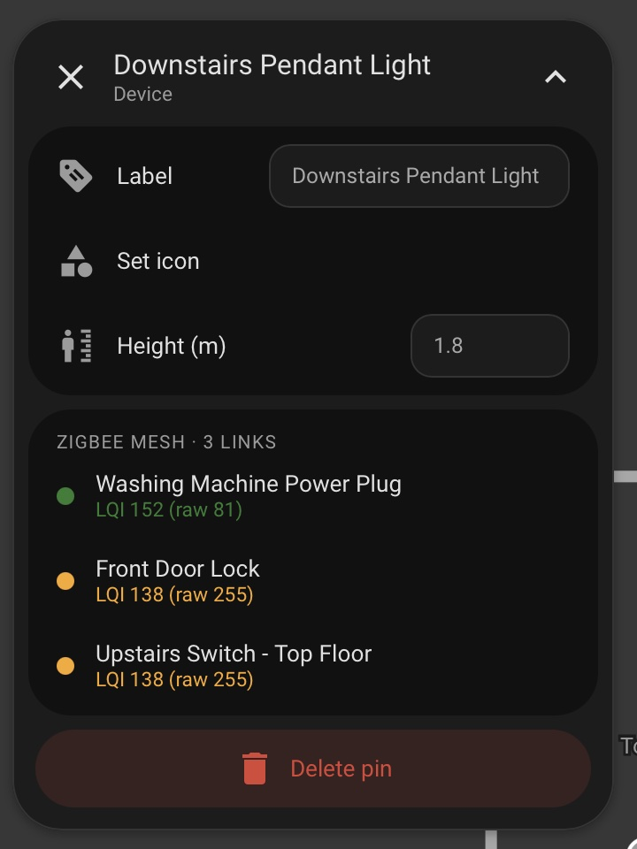
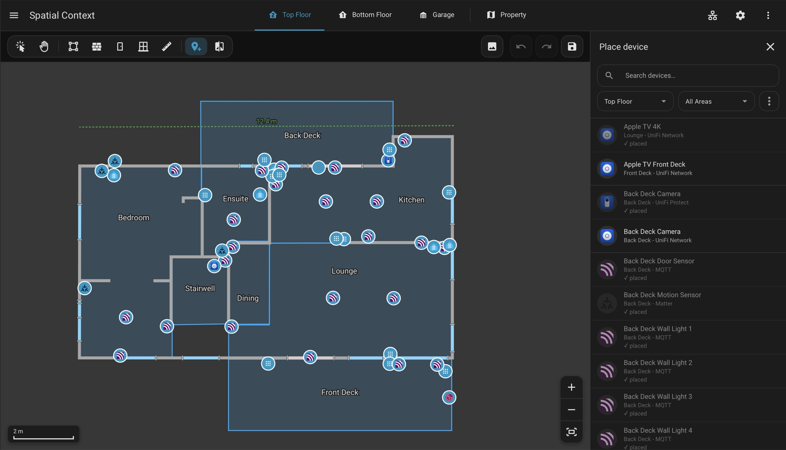
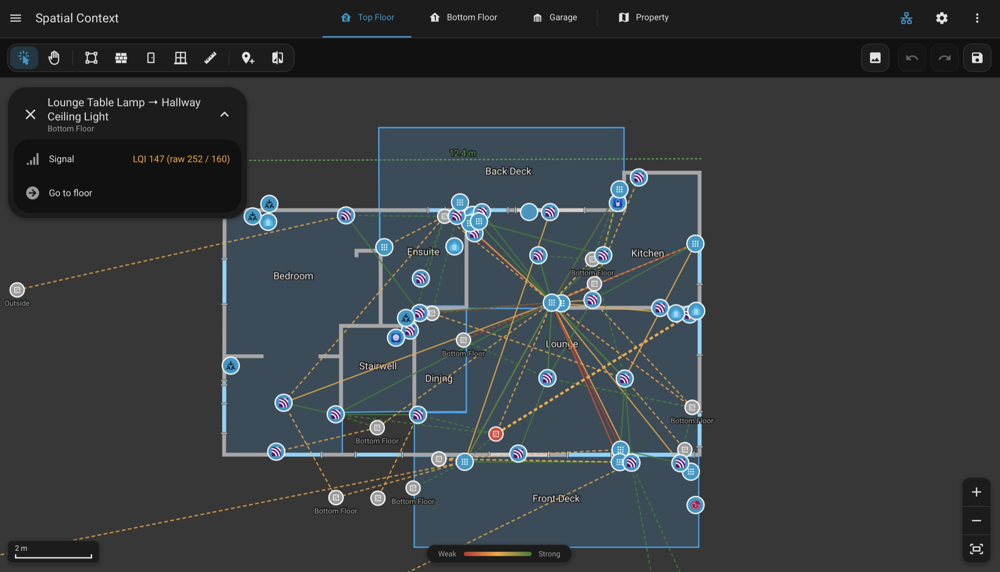
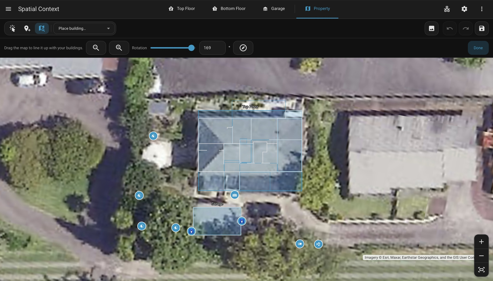

# Spatial Context


**Give your AI assistant a floor plan of your home.**

Home Assistant knows your devices by name and area, but not where anything actually *is*: how far the hallway sensor is from the router, which walls sit between a Zigbee bulb and its parent, what's on the other side of the garage door. Spatial Context lets you trace your floor plans over the top of your house plans, place your real devices on them, and hand the result to an AI assistant, an automation or a script as real-world, measured data.


## What you get

- **A floor-plan editor that looks like part of Home Assistant.** One tab per HA floor. Trace rooms and walls over your plans, add doors and windows, calibrate to real metres, and place your actual devices.
- **Data an AI can reason about.** Rooms, walls (with material, thickness and estimated signal loss), doors and windows, and every device's position in real units, from one action or an export.
- **A live Connectivity Map.** Zigbee, Wi-Fi, Matter/Thread and Bluetooth links drawn on your plan and coloured by signal quality, so weak spots are visible where they physically are.
- **A whole-property view.** Place each building on a site photo or a live street or aerial map, along with devices that live outdoors.
- **Works on a phone.** The panel adapts to small screens, with a device picker that becomes a sheet and info cards that fold away.
- **English and German**, following your Home Assistant profile language.

## Requirements

- **Home Assistant 2024.10** or newer, with your floors set up in **Settings → Areas → Floors**.
- The **Connectivity Map** layers each need their own source. Install whichever apply:

| Layer | Needs |
|---|---|
| Zigbee | **Zigbee2MQTT**, connected to Home Assistant over MQTT (ZHA isn't supported) |
| Wi-Fi | An integration that reports each client's access point: **UniFi Network**, **TP-Link Omada**, or the custom **TP-Link Deco** integration |
| Matter / Thread | Home Assistant's **Matter** integration |
| Bluetooth | **Home Assistant 2025.2** or newer, an **admin** account, and Bluetooth devices registered by an integration (BTHome, Xiaomi BLE, SwitchBot and similar). ESPHome Bluetooth proxies are supported |

The Property tab's optional **map background** needs **Home Assistant 2026.10** or newer (its built-in map tile service), a home location set in HA, and a browser with WebGL2. Everything else works without it.

## Installation

Spatial Context is a **beta** and isn't in the HACS default repository yet, so it's added as a **custom repository**.

### Option 1: HACS, one click

[](https://my.home-assistant.io/redirect/hacs_repository/?owner=Greminn&repository=ha-spatial-context&category=integration)

### Option 2: HACS, manually

1. In HACS: **⋮ (top-right) → Custom repositories**.
2. Paste this repository's URL into **Repository**: `https://github.com/Greminn/ha-spatial-context`
3. Set **Type** to **Integration**, then **Add**.
4. Find **Spatial Context** in HACS and install it.

This is a pre-release, so turn on **Show beta versions** for this repository (or globally in HACS's own settings) if you don't see it.

### Option 3: manual copy

Copy `custom_components/spatial_context/` from this repository into your Home Assistant's `/config/custom_components/` directory.

### After installing

Restart Home Assistant, then go to **Settings → Devices & Services → Add Integration → Spatial Context**. **Spatial Context** appears in your sidebar.

## Getting started

1. **Set up floors in HA** if you haven't already: **Settings → Areas → Floors**. Spatial Context has no floor concept of its own; its tabs come straight from there.
2. **Open Spatial Context** from the sidebar and pick a floor tab.
3. **Add a background image**: the **Background** button in the second bar, or drag an image file straight onto the canvas. Starting from a PDF? See [Getting a background image](#getting-a-background-image).
4. **Set the scale**: choose **Set Scale**, click two points a known distance apart, and enter the distance. Do this first; it's what makes every later measurement real.
5. **Trace rooms and walls**: **Trace Room** and **Trace Wall**. Assign each room an HA area, and each wall a material and thickness.
6. **Place your devices**: **Place Device**, pick one from the list, click the plan. A device lives in one place: one floor, or outdoors.
7. **Repeat for every floor.**
8. **Align floors that stack** (upstairs directly over downstairs) with **Align Floors**. This puts them in one coordinate system, which cross-floor links need.
9. **Place buildings on the Property tab**, and any devices that live outdoors.

Changes save automatically a few seconds after each edit.

### Getting a background image

Each floor traces over an image (PNG, JPEG or GIF, uploaded through HA's own image storage). If you're starting from an architect's PDF, rasterise it first:

```
pdftoppm -png -r 150 your-floor-plan.pdf your-floor-plan
```

## The panel



**Header.** The floor tabs and the **Property** tab sit in the middle. On the right are the **Connectivity Map**, **Settings** and a **⋮** menu (Export JSON, Download debug report, Reset floor).

**Controls row** (the second bar). Everything you do on a floor lives here:

| Part | What it holds |
|---|---|
| Left | The tools. Hover any icon for its name. |
| Middle | Hints and options for the current tool, such as the **Snap** menu while tracing. |
| Right | **Background**, then **undo**, **redo** and **save**. |

**Canvas.** Your plan, rooms, walls and devices. The scale bar is bottom-left and zoom buttons bottom-right. A floor that hasn't been calibrated shows a **Not calibrated** chip in place of the bar; click it to start **Set Scale**.

**Info cards.** Click anything on the plan and a card opens on the left with its details and settings. On a phone it spans the width, and the chevron at its top-right folds it down to a header so you can keep working on the map with the item still selected.



On a phone the card spans the width and the controls row scrolls sideways.



*Taken at 11:11, so of course we made a wish. (Fewer bugs, please.)*

### Tools

| Tool | What it does |
|---|---|
| **Select** | The default. Click a room, wall, door, window or device to select it. Drag its handles to reshape it, drag a device to move it, and drag inside a selected room to move the room together with its devices. |
| **Pan** | Moves the view and nothing else, so you can't drag anything by accident. Mouse-wheel or trackpad scrolling also pans in any mode. |
| **Trace Room** | Click each corner, then click back near the start to close the outline. |
| **Trace Wall** | Click along the wall. **Finish Wall** (or **Enter**) ends an open run; clicking back at the start closes a loop. |
| **Add Door**, **Add Window** | Click a point along a traced wall. |
| **Set Scale** | Click two points a known distance apart and enter the distance. Re-run it any time. |
| **Place Device** | Opens the device picker. Pick a device, then click the plan to drop it. Click an existing pin to stack another device on top. |
| **Align Floors** | Overlays another floor so you can line the two up and apply the transform. |



New points snap to nearby walls and room edges and line up with your last point, with a live preview before you click. The **Snap** menu picks what they snap to: everything, walls only, rooms only, or nothing. Hold **Shift** to place a single point freely.

### What the info cards offer

| Selection | You can |
|---|---|
| **Room** | Set its HA **area** (including areas on no floor, such as a deck), **name** it, **edit its corners**, reset a dragged label, **show or hide** it, and style it with a **colour** from Home Assistant's own colour list (or a custom one), **fill opacity** and **border opacity**. |
| **Device** | Set a **label**, a custom **icon** (search every Material Design icon), and a mounting **height**, and see its **network links** while a Connectivity Map layer is on. |
| **Wall** | Set its **material** and **thickness**, and edit its corners. |
| **Door / window** | Set its **width**. |
| **Connectivity link** | See both ends and the signal quality. A link to a device on another floor can jump to that floor. |
| **Devices on one spot** | Choose which to select, or remove one from the spot. |



### Keyboard

| Key | Does |
|---|---|
| **Esc** | Cancels the current trace or armed placement. In the middle of a drag, puts the item back. |
| **Ctrl/Cmd+Z**, **Ctrl/Cmd+Shift+Z** (or **Ctrl+Y**) | Undo and redo, for the open floor and for the Property tab. A drag counts as one step. |
| **Backspace** or **Ctrl/Cmd+Z** while tracing | Removes the last point. |
| **Delete** / **Backspace** | Deletes the selection, after asking. |
| **Enter** | Finishes a wall trace. |
| **Shift** | Places or drags a point with no snapping. |

None of these fire while you're typing in a field.

### Wall materials

Each wall carries a material and a real thickness. Its estimated signal loss is that material's rate per centimetre times the thickness, shown in the export as `attenuation_db`. The rates are approximate 2.4 GHz figures, useful for reasoning, not for engineering.

| Material | Loss (dB/cm) | Default thickness |
|---|---|---|
| Timber framed (drywall) | 0.3 | 10 cm |
| Brick veneer | 0.55 | 11 cm |
| Concrete / block | 0.6 | 20 cm |
| Aerated / foam concrete block (plastered) | 0.37 | 13 cm |
| Ceramic / Poroton block | 0.42 | 25 cm |
| Glass | 2.0 | 1 cm |
| Steel frame | 1.0 | 10 cm |

### Settings

The cog in the header opens **Settings**. They're shared by everyone who uses the panel, and apply instantly.

- **Auto-save changes** (on by default). Switching floors saves first, and leaving with unsaved changes asks.
- **Units**: Metric or Imperial, for every real-world measurement.
- **Floor tab order**: top floor first (like HA's Areas page) or ground floor first. Display only.
- **Zigbee coordinator**: by default the coordinator's links attach to the Zigbee2MQTT Bridge device. If your radio is its own HA device (for example an SLZB-06 adapter) and that's what you placed, pick it here.
- **Zigbee scan timeout** (30 to 600 s, default 180). Raise it if **Refresh** times out on a large mesh.
- **Debug logging** (off by default). See [Reporting a problem](#reporting-a-problem).
- **About**: the installed version and a link to this repository.


## Placing devices

**Place Device** opens a picker beside the plan (a sheet under it on a phone). Search it, filter by floor and area, and click a device to arm it, then click the plan. A device already placed elsewhere is greyed out, with where it is, so a device is never in two places. The ⋮ in the picker clears every placed device on the floor, after asking.



## Connectivity Map

The **network** button in the header opens the layers. Pick one to draw that network's links between your placed devices, coloured weak to strong, with a key along the bottom of the canvas. The layer **stays on** after you close the menu (the button turns blue while one is showing); pick it again to turn it off. Select a device and its card lists every link it has, strongest first, with the signal detail. Click a line for that link's details.



- **Zigbee** comes from Zigbee2MQTT's network scan. A scan takes a minute or two, so results are cached: picking the layer shows the last scan, and **Refresh Mesh** runs a new one. By default it draws each device's strongest link on its own floor and to other floors, every parent and child route, and the coordinator's direct links (LQI 50+). **Show all links** draws the full neighbour table, like Z2M's own map. LQI isn't comparable between chipsets (some Hue bulbs report near 255 for everything, TI coordinators read low), so each device's readings are corrected for its own scale, worked out from how it and its neighbours rate the same links, and a link is graded on its weaker side. The link details show the corrected and the raw values.
- **Wi-Fi** links each client to its access point, with signal strength where available. It works with UniFi Network (including clients whose tracker entity is disabled), TP-Link Omada and the custom TP-Link Deco integration.
- **Matter / Thread** shows Home Assistant's own Matter network topology, updating live.
- **Bluetooth** links each Bluetooth LE device Home Assistant has registered to the scanner or ESPHome proxy that hears it best, graded by RSSI. It updates live from the same data as **Settings → Bluetooth → Visualization**. Place each proxy's ESPHome device and your BLE devices for the lines to show.

**Across floors and outdoors.** A link to a device on another floor draws as a dashed line toward that device's real position, ending in a marker you can use to jump to that floor. Separate buildings use their Property tab placements for direction. Links to devices placed outdoors work the same way, labelled **Outside**.

## The Property tab

The **Property** tab is a whole-site view. Give it a backdrop (an uploaded site photo, a live map, or both), then place a labelled, rotatable rectangle for each *building*. Two floors linked with **Align Floors** collapse to a single placement, so a multi-storey house is one shape. A floor that was never aligned to another, such as a detached garage, gets its own.



- **Map background** (HA 2026.10+): **Background → Add map background** puts a live map behind everything, centred on your Home Assistant home location. **Map type** switches between **Street map**, drawn from Home Assistant's own map tile service with no key and no third-party request, and **Aerial photo (Esri)**, which makes it far easier to place a house on its roof. Aerial tiles are loaded by your browser straight from Esri's servers, so Esri sees your IP address and the area you're viewing, and the credit is shown on the canvas. A **Map opacity** slider sits beside it, and an uploaded image still draws on top of the map, so you can use both.
- **Move map**: your buildings stay where they are and the map moves under them, so you can line a footprint up with the real roof. A third bar appears with the controls. **Drag** to move the map, **Ctrl+scroll** or the zoom buttons to zoom, **Shift+scroll** or the slider to rotate (the compass button resets to north-up), or **pinch and twist** on a touch screen. The map is saved with the layout and its moves can be undone.
- **Place Building**: choose a building from the dropdown in the controls row, then click the photo or map to drop it. Each placed building shows its traced rooms and walls as a faint outline inside its rectangle, so you can see how well it fits.
- **Resize and rotate**: select a placement to drag it, drag a corner to resize it (the shape stays locked to the building's real proportions, so it can't be squashed), or drag the handle above it to rotate.
- **Scale**: there's no separate calibration here. Once a placed building has a floor with **Set Scale** done, the Property tab works out its own scale from that building's size on the photo, and outdoor devices get real-world positions in the export. If placed buildings disagree, a notice says so, which usually means one is sized wrongly against the photo.
- **Outdoor devices**: use the **Place** tool for anything outside every building (garden lights, a gate sensor). The picker opens on **Outdoor / no floor**. Placing a device outdoors takes it off any floor, and vice versa.
- **Outdoor areas on a floor plan**: an HA area that's on no floor (a back deck, say) can still be drawn onto a floor. Pick it under **Outdoor / no floor** in a room's area list.


## Using it with AI assistants and automations

This is what the editor is for. Two actions expose the result:

- **`spatial_context.get_map`** returns the whole layout as the action's response: floors, rooms, walls (with material, thickness and signal loss), doors and windows, and every placed device, indoor and outdoor, with its position in real units. It's the same data as **⋮ → Export JSON**.
- **`spatial_context.refresh_zigbee_mesh`** runs a fresh Zigbee scan and caches it, so the panel's Zigbee layer opens instantly. It suits a nightly automation, not interactive use, because a scan takes a minute or two.

```yaml
# Read the map into a variable, for a script or an AI prompt.
actions:
  - action: spatial_context.get_map
    response_variable: home_map
```

```yaml
# Keep the Zigbee layer's cache warm overnight.
triggers:
  - trigger: time
    at: "03:00:00"
actions:
  - action: spatial_context.refresh_zigbee_mesh
```

What comes back, trimmed:

```json
{
  "exported_at": "2026-10-11T08:30:00+00:00",
  "floors": [
    {
      "floor_id": "top_floor",
      "name": "Top Floor",
      "meters_per_unit": 0.016,
      "rooms": [
        {
          "id": "…",
          "name": "Lounge",
          "devices": [
            {
              "device_id": "…",
              "entity_id": "light.lounge_light",
              "name": "Lounge Light",
              "domain": "light",
              "area_name": "Lounge",
              "x_m": 4.2,
              "y_m": 3.1,
              "height_m": 2.4
            }
          ]
        }
      ],
      "walls": [
        {
          "material": "concrete_block",
          "thickness_cm": 20,
          "attenuation_db": 12.0,
          "points_m": [[0.0, 0.0], [6.1, 0.0]],
          "openings": [{ "type": "door", "width_m": 0.9 }]
        }
      ]
    }
  ],
  "property_meters_per_unit": 0.05,
  "outdoor_devices": []
}
```

Positions are in metres once a floor has been calibrated (`x_m`, `y_m`, `points_m`, `width_m`), and `null` until then. Each device also carries its raw `x` and `y`, and an assistant can work out real distances between any two devices without knowing anything about the editor.

A few things this lets an assistant work out for itself: which room a device is in, how far apart two devices are, which walls and what material sit between a Zigbee router and a flaky sensor, whether a sensor is mounted too high for its detection cone, and what's outdoors.

## Reporting a problem

1. Turn on **Settings → Debug logging**, then reproduce the problem. The panel records what it does (loads, saves, errors, map loads) to `spatial_context_debug.log` in your Home Assistant config folder, capped at about 1 MB.
2. Use **⋮ → Download debug report** and attach the file to a [GitHub issue](https://github.com/Greminn/ha-spatial-context/issues). It contains versions, settings, per-floor counts and the recent log: ids and counts only, never device names or positions.
3. Turn Debug logging off again afterwards.

## After updating

The panel checks itself against what's installed each time it opens, and whenever you come back to its tab. If Home Assistant hasn't been restarted since Spatial Context was updated, a banner asks you to restart (until then, some changes can't be saved). If your browser is still running an older copy of the panel, a banner asks you to reload the page.

## Languages

The panel follows the language of your Home Assistant profile. **English** and **German** are included. The German is machine-drafted, so a native speaker's corrections are very welcome as a pull request or issue against `frontend/src/translations/de.json`. Anything not yet translated falls back to English.

## Development

The panel is built from `frontend/` (Lit and TypeScript) into `custom_components/spatial_context/www/`. The output is committed: HACS and a manual copy both install this repository as-is with no build step, so the built files have to already be there and up to date with the source. A build writes these files, which always go together:

- `spatial-context-panel.js`, the panel itself.
- `spatial-context-panel.build.json`, its build id, which the panel's update check compares against.
- `mdi-index.json`, the icon picker's search index.
- `map/`, the lazily loaded map module (MapLibre) used by the Property tab's map background.

```
cd frontend
npm install
npm run check    # typecheck, lint, format check and build
```

The Python side has a test for the map export that runs without Home Assistant installed:

```
python3 -m unittest discover -s tests
```

Copy the built files onto your Home Assistant's `custom_components/spatial_context/www/` however you can reach its config folder (Samba, the File editor or Studio Code Server add-on, `scp` or `rsync`). A browser reload picks up a new panel, which is served with `Cache-Control: no-cache`. Changes to the Python files (`custom_components/spatial_context/*.py`) need a Home Assistant restart.

If you have SSH access to your host, `frontend/scripts/dev/push.mjs` (`npm run push` or `npm run dev`) automates that step, rsyncing every build file on each build and optionally watching for changes. Copy `frontend/.env.example` to `frontend/.env` and fill in `HA_HOST` and `HA_DEV_PATH` to use it.

## Status

**Beta.** Used daily on the author's own multi-floor home, but the interface may still change between releases, and it hasn't yet been tested against the wide variety of Home Assistant setups a stable release should handle.

Found a bug, or have an idea for something it should do? Please [open an issue](https://github.com/Greminn/ha-spatial-context/issues). Problems and feature ideas are equally welcome, not just polished bug reports. Open ideas so far include an RF coverage heatmap with repeater suggestions, flagging links whose real signal is worse than the walls predict, and more integrations for the Connectivity Map.

## License

[MIT](LICENSE)
